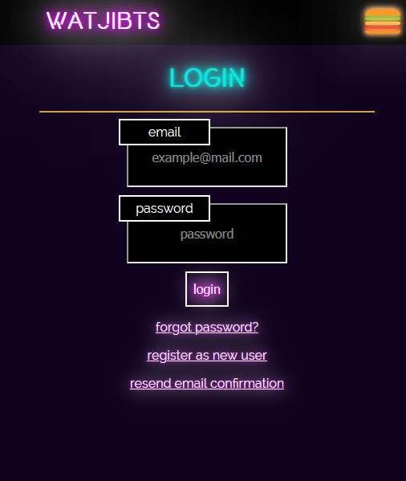
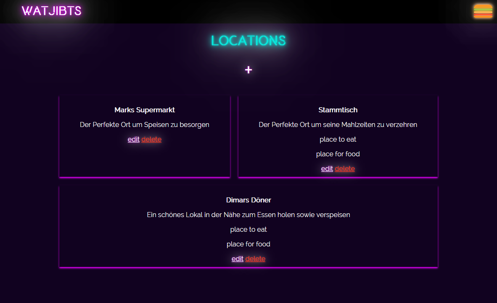
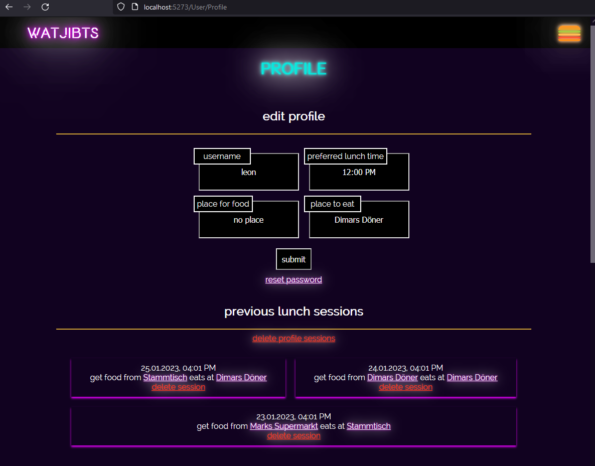
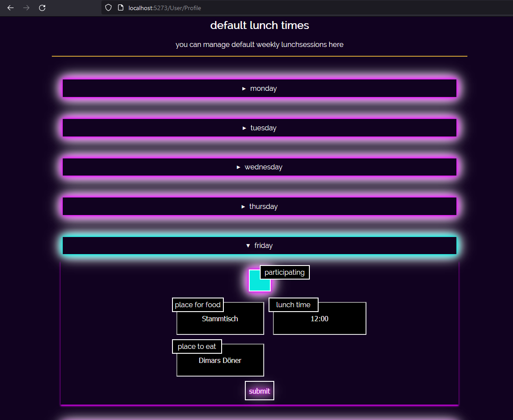
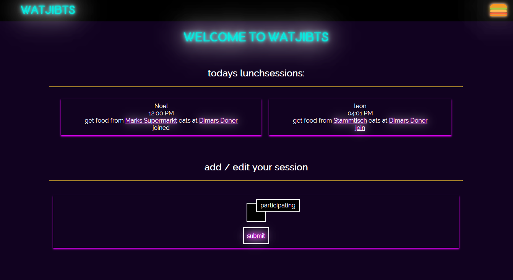
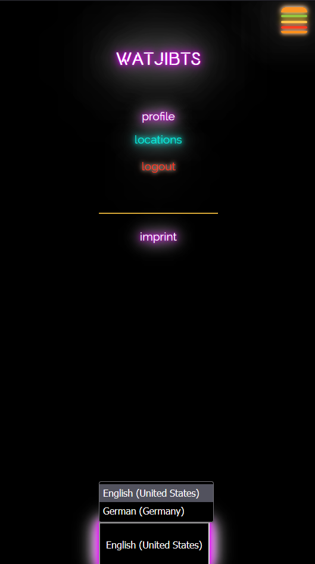
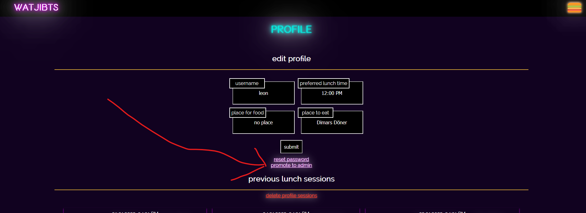

# WatJibts README
<li>
    <a href="#overview">Overview</a>
</li>
<li>
    <a href="#installation">Installation</a>
</li>

## Overview
WatJibts is a planning tool for lunch sessions: - when does who eat what and where does who get what food from.
<br>
Images displayed could be outdated - it might look better ;).
<br>
you can:
<ul>
<li> Create and validate your Account



<li> Add Locations to eat at or get your food from


<li> Save your typical LunchSessions in your Profile (both general and depending on the weekday)



<li> See what your friends / collegues will be foodin and join their session


<li> as of now, WatJibts is supported in two languages, english and german

</ul>

## Installation
### step 0
point with the terminal of your choice to the "src" directory

### step 1: connect your database. 
_I used mysql, you might need further changes in the  Program.cs if you want to use a different database_

create a db `wat-jibts`
change your connectionString in appsettings.json

### step 2: mirgrate
install the migration tool:

```
dotnet tool install --global dotnet-ef
```

add current models to a database migration and migrate, "InitialMigration" is just an example name

```
dotnet ef migrations add InitialMigration
dotnet ef database update
```

### step 3: email via sendgrid
add sendgrid api key, go to https://sendgrid.com and set the user-secrets as follows:

```
dotnet user-secrets init
dotnet user-secrets set SendGridKey <key>
```

### step 4: run
```
dotnet run
```

### step 5: register and promote to admin

make sure to register and promote yourself to be the administrator of the page before sharing (will log you out to reset cookies)


### Bon Appetit :)